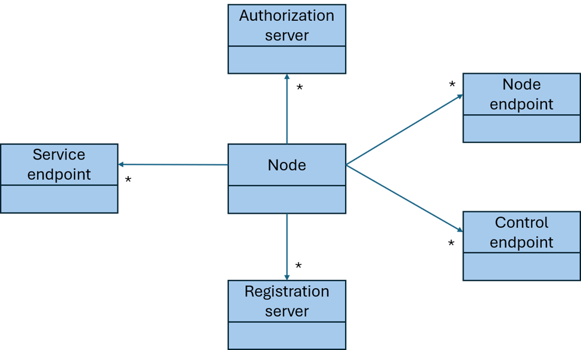

# Matrox: NMOS With Control Plane Security
{:.no_toc}  
Copyright 2026, Matrox Graphics Inc.

Permission is hereby granted, free of charge, to any person obtaining a copy of this software and associated documentation files (the “Software”), to deal in the Software without restriction, including without limitation the rights to use, copy, modify, merge, publish, distribute, sublicense, and/or sell copies of the Software, and to permit persons to whom the Software is furnished to do so, subject to the following conditions:

The above copyright notice and this permission notice MUST be included in all copies or substantial portions of the Software.

THE SOFTWARE IS PROVIDED “AS IS”, WITHOUT WARRANTY OF ANY KIND, EXPRESS OR IMPLIED, INCLUDING BUT NOT LIMITED TO THE WARRANTIES OF MERCHANTABILITY, FITNESS FOR A PARTICULAR PURPOSE AND NONINFRINGEMENT. IN NO EVENT SHALL THE AUTHORS OR COPYRIGHT HOLDERS BE LIABLE FOR ANY CLAIM, DAMAGES OR OTHER LIABILITY, WHETHER IN AN ACTION OF CONTRACT, TORT OR OTHERWISE, ARISING FROM, OUT OF OR IN CONNECTION WITH THE SOFTWARE OR THE USE OR OTHER DEALINGS IN THE SOFTWARE.

---

{:toc}  

## Introduction

This document presents the NMOS control plane security architecture built around the use of TLS and OAuth2.0. It supersedes the "NMOS With OAuth2.0" document, integrating the exact same functionality and requirements. The NMOS data plane security architecture is described in the "NMOS With Privacy Encryption" document. The "NMOS With Node Reservation" document completes the security architecture, combining control and data plane security by injecting a control plane secret into the privacy encryption key derivation, such that only the Nodes owning that secret can be controlled and can access the media.

This document presents modifications / changes to the AMWA/NMOS IS-10 and BCP-003-02 specifications.

The AMWA/NMOS IS-10 and BCP-003-02 specifications are overly generic and complex for implementation across all device classes. In particular, the overhead associated with these specifications, as currently written, is too demanding for smaller devices. This document proposes a balanced approach, offering a compromise between full specification support and the practical need for managing read/write access authorizations to NMOS APIs of an NMOS Node.

An NMOS Node configured to perform OAuth2.0 Bearer token validation on its NMOS API endpoints implements, as a Resource Server, the modified specification. An NMOS Node is not expected to behave as an OAuth2.0 Client, the NMOS Registry registration API being expected to be secured by TLS client/server certificates only.

## Use of Normative Language

The key words "MUST", "MUST NOT", "REQUIRED", "SHALL", "SHALL NOT", "SHOULD", "SHOULD NOT", "RECOMMENDED", "MAY", and "OPTIONAL" in this document are to be interpreted as described in [RFC 2119][RFC-2119].

# Definitions

The NMOS terms User, Controller, Registry, Node, Device, Source, Flow, Sender, Receiver are used as defined in the [NMOS Glossary](https://specs.amwa.tv/nmos/main/docs/Glossary.html). For the purposes of this document, the terms, and definitions of the following apply.

| Term | Definition |
| --- | --- |
| NMOS | AMWA Networked Media Open Specifications |
| AMWA | Advanced Media Workflow Association |
| BCP | Best Current Practice |
| CA | Certificate Authority |
| CESTCA | Control Endpoints Server Trusted CA |
| CESTCRL | Control Endpoints Server Trusted Certificate Revocation List |
| CN | Common Name |
| CRL | Certificate Revocation List |
| CTCA | Client Trusted CA |
| CTCRL | Client Trusted Certificate Revocation List |
| DNS | Domain Name System |
| DNS-SD | DNS Service Discovery |
| ECDSA | Elliptic Curve Digital Signature Algorithm |
| GTCRL | Global Trusted Certificate Revocation List |
| HTTP | Hypertext Transfer Protocol |
| HTTPS | Hypertext Transfer Protocol Secure |
| IETF | Internet Engineering Task Force |
| IS | Interface Specification |
| JWT | JSON Web Token |
| mDNS | Multicast DNS |
| mTLS | Mutual Transport Layer Security |
| MS | Method Specification |
| NAP | Node Access Policy |
| NESTCA | Node Endpoints Server Trusted CA |
| NESTCRL | Node Endpoints Server Trusted Certificate Revocation List |
| NMOS | Networked Media Open Specifications |
| NTP | Network Time Protocol |
| OAIM | OAuth 2.0 Audience Identification Mode |
| PEM | Privacy Enhanced Mail |
| PFS | Perfect Forward Secrecy |
| PKCS | Public Key Cryptography Standards |
| PTP | Precision Time Protocol |
| RAAM | Restricted Access Authorization Mode |
| RAP | Registry Access Policy |
| RFC | Request for Comments |
| RSA | Rivest-Shamir-Adleman |
| SAN | Subject Alternative Name |
| SMPTE | Society of Motion Picture and Television Engineers |
| TCC | TLS Client Certificate |
| TCT | TLS Certificate Type |
| TLS | Transport Layer Security |
| TSC | TLS Server Certificate |
| VSF | Video Services Forum |

# Scope

This specification does not redefine NMOS APIs or resource models; it specifies additional and/or overriding control-plane security requirements for the NMOS interfaces a Node exposes and consumes, as defined by the applicable AMWA NMOS specifications.

This specification is based on AMWA IS-10 and AMWA BCP-003-01. Where any requirement in this specification conflicts with a requirement in AMWA IS-10 or AMWA BCP-003-01, the requirement in this specification MUST take precedence for any implementation claiming compliance with this specification.

A newly manufactured device MUST implement the default values specified in this specification for all security-relevant configuration options for which defaults are defined. The scope of any vendor-specific mechanisms for a device to restore partially or fully the manufactured state is outside the scope of this specification.

## NMOS Node



An NMOS Node comprises multiple Node API endpoints (IS-04) declared in the api.endpoints attribute of the Node’s “node” resource. It also comprises a number of control API endpoints (IS-05, IS-08, IS-11, IS-12, IS-14, etc.), as declared in the controls attribute of the Node’s “device” resources. Optionally, an NMOS Node exposes some service API endpoints and declares them in the services attribute of the Node’s “node” resource. All those endpoints are in the scope of this specification.

Additionally, an NMOS Node listens to and serves other client accesses from the network that are outside the scope of this specification.

An NMOS Node performs client accesses to a number of NMOS Registry’s Registration API endpoints and IS-10 OAuth 2.0 endpoints. Accesses to those endpoints are in the scope of this specification.

Additionally, an NMOS Node performs other client accesses to network services that are outside the scope of this specification.

Note: Accesses from/to IS-05 transport streams (RTP, MQTT, WebSocket, etc.) are outside the scope of this specification which focuses on the standard NMOS TCP/IP based control plane, excluding transport streams that are covered in IS-05 or BCP-007 transport specific documents.

Note: Accesses to / from DHCP, PTP, NTP, DNS, mDNS services are not covered by this document. Similarly, 802.1x protection of the Ethernet access is outside the scope of this specification.

## NMOS Registry

The IS-04 Registration API MUST not require the NMOS Nodes to use OAuth 2.0 authorizations. The IS-04 Registration API MUST be secured using TLS with server authentication or mutual client-server authentication.

- `api_auth` of the Registry DNS-SD record MUST be false.

## Peer to Peer Mode

A Node operating in peer-to-peer mode (without an NMOS Registry) broadcasts its Node API information through mDNS which is not encrypted, providing an “Unrestricted Read Only” access to the broadcast information. mDNS payload content is out of scope of this specification. The Node’s Node API follows the regular Node Access Policy (NAP).

A device MUST provide a configuration option to turn off peer-to-peer mode to prevent any use of mDNS for strict customer security policies.

# TLS Communications and Cipher Suites

A device MUST comply with this specification. This specification is based on AMWA BCP-003-01 for secure communications; where requirements differ, this specification is authoritative. The following additional requirements apply:

Implementations SHOULD support TLS 1.3 (RFC 8446) and MUST support TLS 1.2 (RFC 5246). While TLS v1.2 is supported for backward compatibility, implementations SHOULD prefer TLS v1.3 for enhanced security.
`
All TLS connections MUST use cipher suites that provide Perfect Forward Secrecy (PFS), such as those based on ECDHE or DHE. A device MUST support the ephemeral key exchange groups `25519` and `secp256r1` and SHOULD support `secp521r1` and `448`.

Note: The cipher suite naming in this section follows the universal IANA/RFC nomenclature (e.g. `TLS_AES_128_GCM_SHA256`), which corresponds to the suites defined in AMWA BCP-003-01. The curve names (e.g. `25519`, `448`) follow the nomenclature used in VSF TR-10-13 (PEP) and correspond to the `X25519` and `X448` groups in universal TLS nomenclature.

For TLS v1.2, a device MUST support the cipher suite `TLS_ECDHE_RSA_WITH_AES_128_GCM_SHA256` and SHOULD support `TLS_ECDHE_ECDSA_WITH_AES_128_GCM_SHA256`, `TLS_ECDHE_ECDSA_WITH_AES_256_GCM_SHA384`, `TLS_ECDHE_RSA_WITH_AES_256_GCM_SHA384`, `TLS_DHE_RSA_WITH_AES_128_GCM_SHA256`, `TLS_DHE_RSA_WITH_AES_256_GCM_SHA384`. A device MAY support the `TLS_ECDHE_RSA_WITH_CHACHA20_POLY1305_SHA256` and `TLS_ECDHE_ECDSA_WITH_CHACHA20_POLY1305_SHA256` cipher suites.

A device MAY support the `TLS_ECDHE_RSA_WITH_AES_128_CBC_SHA256`, `TLS_ECDHE_ECDSA_WITH_AES_128_CBC_SHA256`, `TLS_ECDHE_ECDSA_WITH_AES_256_CBC_SHA384`, `TLS_ECDHE_RSA_WITH_AES_256_CBC_SHA384`, `TLS_DHE_RSA_WITH_AES_128_CBC_SHA256`, `TLS_DHE_RSA_WITH_AES_256_CBC_SHA256` cipher suites when required due to constrained-device performance or capability limitations. A CBC-mode cipher suite SHOULD not be used unless the encrypt_then_mac extension is successfully negotiated.

For TLS v1.3, a device MUST support the cipher suite `TLS_AES_128_GCM_SHA256` and SHOULD support `TLS_AES_256_GCM_SHA384` and `TLS_AES_128_CCM_SHA256`. A device MAY support the `TLS_CHACHA20_POLY1305_SHA256` cipher suite.

For state-of-the-art security, the use of GCM-based suites or TLS v1.3 is strongly recommended.

Only the cipher suites and key exchange groups listed as "MUST", "SHOULD", or "MAY" in this section MUST be used. All other cipher suites are prohibited.

# Registry Access Policy (RAP)

An NMOS Registry operates in one of the following policies regarding access to the Registration of resources. All the NMOS registry accessible by an NMOS Node MUST use the same access policy.

## Unrestricted Registration

An NMOS Registry configured with that policy grants registration access to anyone.

If the `api_proto` parameter of the Registry DNS-SD record is “http”, the IS-04 Registration API is not protected by TLS.

If the `api_proto` parameter of the Registry DNS-SD record is “https”, the IS-04 Registration API is protected by TLS and a device MUST authenticate the Registry using TLS server authentication.

Shall be supported by all compliant devices.

## Restricted Registration

An NMOS Registry configured with that policy grants registration access to those presenting a client certificate authorized for registration. A device and a Registry MUST authenticate each other using TLS mutual authentication.

- `api_proto` of the Registry DNS-SD record MUST be “https”

Shall be supported by all compliant devices.

# Node Access Policy (NAP)

An NMOS Node operates in one of the following policies regarding access to the Node’s resources and states. A device MUST allow an administrator to configure the device to use one of the following policies, which default to “Unrestricted Read Write”. The policy applies to all incoming accesses to the Node’s endpoints and to all outbound client accesses performed by the Node.

## Unrestricted Read Write

A device configured with that policy explicitly indicates that it is not compliant with this specification. In that specific case, the protocol is HTTP without TLS, and the device MUST not claim compliance with this specification while so configured.

- Unrestricted read access MUST be permitted to all clients.

- Unrestricted write access MUST be permitted to all clients.

The Node's endpoints protocol and services href attribute indicates HTTP and the authorization attribute is false. The Device's control endpoints href attribute indicates HTTP and the authorization attribute is false.

## Unrestricted Read Only

A device configured with that policy grants read only access to anyone, but requires authorization for write access (accesses with side effects on the device state). This mode of operation is not allowed when OAuth 2.0 authorizations are used, in which case even read access MUST be explicitly provided by the OAuth 2.0 authorizations.

- Unrestricted read access MUST be permitted to all clients.

- Restricted write access MUST be enforced by the NMOS Node in accordance with the configured RAAM policy.

The Node's endpoints protocol and services href attribute indicates HTTPS and the authorization attribute is set according to RAAM. The Device's control endpoints href attribute indicates HTTPS and the authorization attribute is set according to RAAM.

## Restricted Read Write

A device configured with that policy grants read and write access to only those having the proper authorization. This mode of operation MUST be supported by all devices. conforming to this specification.

- Restricted read access MUST be enforced by the NMOS Node in accordance with the configured RAAM policy.

- Restricted write access MUST be enforced by the NMOS Node in accordance with the configured RAAM policy.

The Node's endpoints protocol and services href attribute indicates HTTPS and the authorization attribute is set according to RAAM. The Device's control endpoints href attribute indicates HTTPS and the authorization attribute is set according to RAAM.

# Restricted Access Authorization Mode (RAAM)

An NMOS Node applies access restrictions based on one of the following modes of operation: Mutual TLS authentication, Server TLS authentication with OAuth 2.0 authorizations, or Mutual TLS authentication with OAuth 2.0 authorizations.

## Mutual TLS authentication

- Shall be supported by all compliant devices not supporting IS-10 or when an IS-10 OAuth 2.0 server is not available.

- Clients are authorized if properly authenticated.

- RSA, ECDSA or both (ECDSA attempted first by client)

  - A device MUST allow an administrator to configure the type of certificates to use as RSA, ECDSA, or both. The certificate type applies to both endpoint and client accesses, and to server and client certificates.

  - RSA and ECDSA MUST independently be supported by all compliant devices. Supporting both simultaneously is optional.

The Node's endpoints `protocol` and services `href` attribute indicates HTTPS and the `authorization` attribute is set to false. The Device's control endpoints `href` attribute indicates HTTPS and the `authorization` attribute is set to false.

## Server TLS authentication with OAuth 2.0 authorizations

- Shall be supported by all compliant devices supporting IS-10 when an IS-10 OAuth 2.0 server is available.

- Clients are authorized only by explicit OAuth 2.0 authorizations

- RSA, ECDSA or both (ECDSA attempted first by client)

  - A device MUST allow an administrator to configure the type of certificates to use as RSA, ECDSA, or both. The certificate type applies to both endpoint and client accesses, and to server and client certificates.

  - RSA and ECDSA MUST independently be supported by all compliant devices. Supporting both simultaneously is optional.

The Node's endpoints `protocol` and services `href` attribute indicates HTTPS and the `authorization` attribute is set to true. The Device's control endpoints `href` attribute indicates HTTPS and the `authorization` attribute is set to true.

## Mutual TLS authentication with OAuth 2.0 authorizations

- Clients are authorized if properly authenticated and have explicit OAuth 2.0 authorizations.

- RSA, ECDSA or both (ECDSA attempted first by client)

  - A device MUST allow an administrator to configure the type of certificates to use as RSA, ECDSA, or both. The certificate type applies to both endpoint and client accesses, and to server and client certificates.

  - RSA and ECDSA MUST independently be supported by all compliant devices. Supporting both simultaneously is optional.

The Node's endpoints `protocol` and services `href` attribute indicates HTTPS and the `authorization` attribute is set to true. The Device's control endpoints `href` attribute indicates HTTPS and the `authorization` attribute is set to true.

# Device Configuration Options

## Registry Access Policy (RAP)

- Unrestricted Registration (default = HTTP) (value 0)

- Unrestricted Registration (HTTPS server authentication) (value 1)

- Restricted Registration (HTTPS mutual authentication) (value 2)

- A device compliant with this specification MUST support the Unrestricted and Restricted Registration modes.

## Node Access Policy (NAP)

- Unrestricted Read Write (default = HTTP) (value 0)

- Unrestricted Read Only (value 1)

- Restricted Read Write (value 2)

- A device compliant with this specification MUST support the Restricted Read Write mode.

## Restricted Access Authorization Mode (RAAM)

- Mutual TLS Authentication (default) (value 0)

- OAuth 2.0 Authorizations (value 1)

- Mutual TLS Authentication with OAuth 2.0 Authorizations (value 2)

- A device compliant with this specification, not supporting IS-10 or when an IS-10 OAuth 2.0 server is not available, MUST support Mutual TLS Authentication.

- A device compliant with this specification, supporting IS-10 and when an IS-10 OAuth 2.0 server is available, MUST support OAuth 2.0 Authorizations.

Note: The expression “not supporting IS-10 or when an IS-10 OAuth 2.0 server is not available” refers to a configuration option of the device activating/de-activating the use of an OAuth2.0 server on the network. A device supporting IS-10 could have this option enabled or disabled.

## OAuth 2.0 Audience Identification Mode (OAIM)

- Serial Number (default) (value 0)

- TLS Server Certificate (TSC) Common Name (CN) or alternative DNS names. (value 1)

- Either (value 2)

- A device compliant with this specification MUST support all modes.

## TLS Certificate Type (TCT)

- RSA (default) (value 0)

  - RSA certificates MUST use a minimum key size of 2048 bits.

- ECDSA (value 1)

  - ECDSA certificates MUST use a minimum curve size equivalent to secp256r1 or 25519.

- Both (value 2)

- Shall be common to all certificates and Root CAs of the device.

- RSA and ECDSA MUST independently be supported by all compliant devices. Supporting both simultaneously is optional.

## TLS Server Certificate(s) (TSC)

- According to TLS Certificate Type (TCT) configuration

- Default: Vendor certificates or None (MUST be configured in order to enable related configurations)

- May be common for the Node and Control endpoints or specific to each one.

## Client Trusted CA(s) (CTCA)

- According to TLS Certificate Type (TCT) configuration

- Root or Intermediate CA(s)

- Default: Vendor Root CA(s)

- Used to validate the TLS Server Certificate of the NMOS Registry and the OAuth 2.0 Authorization Server.

- May be common for the Registration and Authorization accesses or specific to each one.

- Shall support at least two CTCA for each type of access in order to allow certificate re-provisioning.

- Also used to verify Certificate Revocation List CRL as per X.509

## Client Trusted Certificates Revocation List(s) (CTCRL)

- According to TLS Certificate Type (TCT) configuration

- Signed by a Client Trusted CA(s)

  - If the server certificate is signed by intermediate CA, not the root directly, the CRL must be signed by the intermediate CA.

- Used to validate a TLS Server Certificate of the NMOS Registry and the OAuth 2.0 Authorization Server.

- Shall support at least two CTCRL in order to allow certificate re-provisioning.

## TLS Client Certificate(s) (TCC)

- According to TLS Certificate Type (TCT) configuration

- Default: Vendor certificates or None (MUST be configured in order to enable related configurations)

- May be common for the Registration and Authorization accesses or specific to each one.

- May be hidden to a User when the Restricted Access Authorization Mode does not include mutual authentication.

## Node endpoints Server Trusted CA(s) (NESTCA)

- According to TLS Certificate Type (TCT) configuration

- Root or intermediate CA(s)

- Default: Vendor Root CA(s) or None (MUST be configured in order to enable related configurations)

- Used to validate a TLS Client Certificate on the Node endpoints and services.

- May be hidden to a User when the Restricted Access Authorization Mode does not include mutual authentication.

- Shall support at least two NESTCA in order to allow certificate re-provisioning.

## Node endpoints Server Trusted Certificates Revocation List (NESTCRL)

- According to TLS Certificate Type (TCT) configuration

- Signed by a Node endpoints Server Trusted CA(s)

  - If the client certificate is signed by intermediate CA, not the root directly, the CRL must be signed by the intermediate CA.

- Used to validate a TLS Client Certificate(s) on the Node endpoints and services.

- Shall support at least two NESTCRL in order to allow certificate re-provisioning.

## Control endpoints Server Trusted CA(s) (CESTCA)

- According to TLS Certificate Type (TCT) configuration

- Root or intermediate CA(s)

- Default: Vendor Root CA(s) or None (MUST be configured in order to enable related configurations)

- Used to validate a TLS Client Certificate on the Control endpoints.

- May be hidden to a User when the Restricted Access Authorization Mode does not include mutual authentication.

- Shall support at least two CESTCA in order to allow certificate re-provisioning.

## Control endpoints Server Trusted Certificates Revocation List(s) (CESTCRL)

- According to TLS Certificate Type (TCT) configuration

- Signed by a Control endpoints Server Trusted CA(s)

  - If the client certificate is signed by intermediate CA, not the root directly, the CRL must be signed by the intermediate CA.

- Used to validate a TLS Client Certificate(s) on the Control endpoints.

- Shall support at least two CESTCRL in order to allow certificate re-provisioning.

## Additional Provisions:

- The device MUST provide a means to update trust material such that a valid existing trust configuration remains usable until a new configuration has been successfully validated.

- When an administrator changes the security policy configuration (e.g., NAP, RAP, RAAM, OAIM, TCT) or updates trust material (CAs, CRLs, certificates), new connections MUST follow the new configuration immediately. Existing sessions MUST continue with the configuration that was in effect when the session was established until they can safely be terminated.

- The device MUST provide a means for an administrator or management system to retrieve the current effective values of the security policy configuration options described in this section (e.g., NAP, RAP, RAAM, OAIM, TCT) and to identify the trust material in use (e.g., certificates, CAs, CRLs) through non-sensitive metadata (such as subject/issuer names, validity dates, serial numbers, fingerprints, or equivalent identifiers). Private keys are out of scope for retrievable configuration and MUST be write-only and MUST not be retrievable. User interfaces MAY omit options that are not applicable under the current configuration.

- An implementation MAY combine the Client Trusted Certificates Revocation List (CTCRL), Node endpoints Server Trusted Certificates Revocation List (NESTCRL) and Control endpoints Server Trusted Certificates Revocation List (CESTCRL) into a single Global Trusted Certificates Revocation List (GTCRL) by concatenating the various CRL, each signed by its respective CA. If a single CA is used across all CTCA, NESTCA and CESTCA, then a single CRL MAY be used.

  - There MUST be as many different CRL as there are when described as independent resources.

  - All the CA(s) CTCA, NESTCA and CESTCA MUST be considered during the validation of the CRL signature.

- Certificates and Private Keys are either transferred in PEM format or PKCS#12 encrypted with a strong password .p12 format.

  - When using the PEM format the transfer channel MUST be secure.

  - When using the PKCS#12 format the transfer of the password MUST be secure.

## NMOS Tags

The following tags SHOULD be published in the Node’s ‘tags’ attribute to indicate the configuration of the Node’s security parameters: NAP, RAP, RAAM, OAIM, TCT.

`urn:x-matrox:tag:security:nap-config/v1.0`  
`urn:x-matrox:tag:security:rap-config/v1.0`  
`urn:x-matrox:tag:security:raam-config/v1.0`  
`urn:x-matrox:tag:security:oaim-config/v1.0`  
`urn:x-matrox:tag:security:tct-config/v1.0`  

The value of those tags is an array of strings where the first entry (index 0) MUST be the single decimal digit in string form of the value associated with the configuration option. The second entry (if any, index 1) MAY be a string of a maximum of 128 characters describing the configuration value.

# IS-10 Authorizations General Provisions

## IS-10 and BCP-003-02

An implementation supporting the OAuth 2.0 authorization scheme MUST comply with AMWA/NMOS IS-10 and AMWA BCP-003-02 except where this specification specifies otherwise. In case of conflict, this specification takes precedence.

Note: This specification overrides some of the IS-10 and BCP-003-02 requirements and provides additional specific requirements to favor smaller, simpler and more deterministic implementations in devices.

# IS-10 Authorizations specific requirements

## Scope

The `scope` of an OAuth 2.0 authorization is usually the name of the NMOS API used in the path to access the API. For example, accessing the IS-05 ConnectionAPI at http://api.example.com/x-nmos/connection/{version} implies the "connection" scope. For IS-04 NodeAPI, QueryAPI, RegistrationAPI, IS-05 ConnectionAPI, IS-08 ChannelMappingAPI, IS-11 StreamCompatibilityManagementAPI and the IS-14 ConfigurationAPI the `scope` MUST be "node", "query", "registration", "connection", "channelmapping", "streamcompatibility" and "configuration" respectively. For IS-12 the `scope` for accessing the MS-05-02 API  MUST either be "nc" or "control". For accessing an "x-manufacturer" based API the `scope` MUST be "manufacturer".

## Paths

Access to "/" and "/x-nmos" MUST use the "node" API `scope`. Access to "/x-manufacturer" and "/x-manufacturer/*" MUST use the "manufacturer" `scope`.

Access to an endpoint of the "urn:x-nmos:control:ncp" control type MUST use either the "nc" or "control" API `scope`.

## Behavior

### Time Synchronization

The requirements on the clock used by NMOS Nodes are relaxed. An NMOS Node MAY not be capable of synchronizing its clock to an external source of time. The Node estimation of the true time MUST be within 30 minutes of the true NTP / PTP time used by the OAuth 2.0 Authorization Server. The estimated time used by the Node to validate the claims of a token MUST comply with this requirement. The estimated time used by the Node to schedule the fetch / update of the OAuth 2.0 Authorization Server public keys MUST comply with this requirement.

### Public Keys

An NMOS Node MUST cache the OAuth 2.0 Authorization Server Public Keys. An NMOS Node MUST fetch an initial set of Public Keys after it boots/resets/restarts or after an explicit administrative request, and it MUST update them every 23 hours plus X seconds, where X is a random number in the range 0 to 3600. If an NMOS Node cannot obtain an initial set of the Public Keys, it MUST refuse access to the NMOS APIs until it retries and obtains an initial set of Public Keys. An NMOS Node MUST invalidate the Public Keys from a previous fetch / update operation 36 hours after obtaining them. It MUST then refuse access to NMOS APIs until it is able to obtain a new set of Public Keys. An NMOS Node SHOULD use an exponential backoff, from 1 to 64 seconds, when retrying a fetch / update operation.

An NMOS Node MUST log an event if it invalidates the Public Keys and it SHOULD log an event when it gets a set of Public Keys. An NMOS Node MAY log an event when it starts refusing access because of a lack of Public Keys. An NMOS Node MAY log an event when it stops refusing access because of a lack of Public Keys.

An NMOS Node MUST discover through DNS-SD the OAuth 2.0 Authorization Servers URL from the standard IS-10 _nmos-auth._tcp service or it MAY be configured with a list of URLs. An NMOS Node MUST not use the `iss` claim of a Bearer token to get Public Keys. All the accessible OAuth 2.0 Authorization Servers MUST publish the same set of Public Keys such that any OAuth 2.0 Authorization Server MAY be used by an NMOS Node to obtain the Public Keys and validate access tokens.

Note: The api_selector value is obtained from the DNS-SD TXT records.

An NMOS Node MUST use TLS v1.2 or v1.3 when fetching / updating Public Keys from an OAuth 2.0 Authorization Server. It MUST validate that the Authorization Server certificate has been signed by a trusted Certificate Authority. An NMOS Node MUST be configured with a set of trusted Certificate Authorities for validating access to OAuth 2.0 Authorization Servers.

#### Authorization Server Metadata Endpoint

The location of the Public Keys (the `jwks_uri`) is not advertised directly. It MUST be obtained from the Authorization Server's metadata document, defined in RFC-8414 and referenced from IS-10. The DNS-SD `_nmos-auth._tcp` advertisement carries only the Authorization Server's hostname and port, plus an optional `api_selector` TXT record corresponding to the path component of the issuer identifier (per RFC-8414 §3.1, with leading and trailing / omitted).

IS-10 / RFC-8414 specifies that the metadata URL is constructed by inserting `/.well-known/oauth-authorization-server` between the host and the `api_selector`:

`{scheme}://{hostname}:{port}/.well-known/oauth-authorization-server\[/{api_selector}\]`

In practice, some widely deployed Authorization Servers instead serve the metadata at the alternative form with the `api_selector` placed before the `well-known` suffix:

`{scheme}://{hostname}:{port}\[/{api_selector}\]/.well-known/oauth-authorization-server`

In addition, every OpenID-Connect-compliant Authorization Server publishes an equivalent metadata document at the OpenID Connect Discovery 1.0 location, which uses the same "well-known appended to the issuer" placement form:

`{scheme}://{hostname}:{port}\[/{api_selector}\]/.well-known/openid-configuration`

The OpenID Connect Discovery document carries a `jwks_uri` field with the same semantics as the RFC-8414 metadata document and SHOULD be considered an acceptable substitute for it.

To remain interoperable with Authorization Servers, an NMOS Node MUST attempt the following URLs in order, stopping at the first one that returns HTTP 200 with a parseable JSON metadata document:

`{scheme}://{hostname}:{port}/.well-known/oauth-authorization-server\[/{api_selector}\]`

`{scheme}://{hostname}:{port}\[/{api_selector}\]/.well-known/oauth-authorization-server`

`{scheme}://{hostname}:{port}\[/{api_selector}\]/.well-known/openid-configuration`

The three forms collapse to two (or one) distinct URLs when no api_selector is present, so the additional probes are no-ops for Authorization Servers whose issuer has no path component.

Once a metadata document has been retrieved, the Node MUST read the `jwks_uri` field from that document and fetch the Public Keys from that URI. The Node MUST not hardcode the JWKS path (e.g. `/.well-known/jwks.json` or `/jwks`); the JWKS location is identified normatively only via the metadata document's `jwks_uri`.

### Access Token

#### Lifetime

Authorizations are not meant to be provided for short periods of time. An authorization is expected to be delivered for an immediate need for a complete workday. An OAuth 2.0 Bearer token MUST have a minimum expiration time (`exp` claim) of 1 hour and a maximum of 24 hours from its creation time (`iat` claim).

If the Node estimated time is greater than the `exp` claim value, accounting for the clock synchronization tolerance defined in this specification, the request MUST be rejected with HTTP 401 (`Unauthorized`).

#### Type and Algorithms

The JOSE header `typ` parameter MUST be present and MUST have one of the following values: "JWT", "at+jwt", or "application/at+jwt".

The algorithm `alg` used for signing the Bearer token MUST be one of "RS256", "RS512", "ES256", or "ES512". When "ES256" is used, the elliptic curve MUST be `P256`. When "ES512" is used, the elliptic curve MUST be `P521`.

Note: This specification extends the interoperability expectations of IS-10.

The Authorization Server MAY use any of the permitted `alg` values listed above; therefore, a Node claiming compliance with this specification MUST support validation of Bearer tokens using all permitted alg values.

#### Grants

NMOS Controllers and similar NMOS sub-systems MUST obtain Bearer tokens to access the APIs of NMOS Nodes.

NMOS Controllers and similar NMOS sub-systems SHOULD obtain Bearer tokens with `client_credentials` grants to access the APIs of NMOS Nodes.

NMOS Controllers, similar NMOS sub-systems, users and tools MAY obtain Bearer tokens with `authorization_code` grants to access the APIs of NMOS Nodes.

The `sub` and `client_id` claims of a Bearer token MUST be equal for the `client_credentials` grant and MUST not be equal for the `authorization_code` and other grants.

An NMOS Node MAY be configured by an administrator to a) only accept Access Tokens with `client_credentials` grants, b) only accept Access Tokens with `authorization_code` grants, or c) accept both `client_credentials`  and `authorization_code` grants. By default, both client_credentials and authorization_code grants shall be supported.

The claims `iss`, `aud`, `sub`, `exp`, `scope`, `client_id` MUST be present in the Bearer token.

The `nbf` claim SHOULD not be present in the Bearer token. If it is present, it MAY be ignored.

The `iat` claim MAY be present in the Bearer token. If it is present, it MUST be ignored.

The private claims `x-nmos-*` SHOULD be placed in an `ext` claim to separate them from standard claims. An NMOS Node MUST support having the private claims `x-nmos-*` either in the `ext` claim or along with the standard claims. An Access Token SHOULD either have the private claims `x-nmos-*` in the `ext` claim or along with the standard claims. If the private `x-nmos-*` claims are duplicated, they MUST be identical.

#### Validation

An NMOS Node MUST require TLS v1.2 or v1.3 when serving HTTP requests. An NMOS Node MUST only accept Access Tokens from the Authorization HTTP header of a request.

An NMOS Node MUST validate the cryptographic signature of the Access Token before processing any claims. If signature validation fails, the request MUST be rejected with HTTP 401 (`Unauthorized`) and include a `WWW-Authenticate` response header as per RFC 6750.

The following requirements define an ordered sequence of validation steps that MUST be performed in the specified order. Each step MAY block access if validation fails.

ReadOnly access to a Node's API MUST be blocked if one of the following claims rejects Read accesses. ReadWrite access to a Node's API MUST be blocked if one of the following claims rejects Read or Write accesses.

Note: The following requirements are summarized in the pseudo-code section at the end of this specification.

If the OAuth 2.0 Audience Identification Mode (OAIM) configuration is “Serial Number”, the `aud` claim MUST not allow access to the current API if it is not \["*"\] and no entry corresponds to "*", or contains a DNS name that includes, possibly as a sub-string, the [BCP-002-02](https://specs.amwa.tv/bcp-002-02/) Instance Identifier of the NMOS Node. There MAY be additional characters before and after the Instance Identifier in the DNS name. Authorizations SHOULD be delivered to OAuth 2.0 Clients for specific NMOS Nodes based on their serial number, as defined in the [BCP-002-02](https://specs.amwa.tv/bcp-002-02/) Instance Identifier. The DNS name of the `aud` clause matching the Instance Identifier of the Node MUST additionally be either the Common Name (CN) or one of the alternative DNS names of the TLS server certificate associated with the NMOS endpoint.

If the OAuth 2.0 Audience Identification Mode (OAIM) configuration is “TLS Server Certificate Common Name (CN) or alternative DNS names”, the `aud` claim MUST not allow access to the current API if it is not \["*"\] and no entry corresponds to "*", the Common Name (CN), or one of the alternative DNS names of the TLS server certificate associated with the NMOS endpoint. The `aud` entries MAY contain wild-card characters to target a subset of devices on a network. Such wild-carding of domain names is documented in RFC 4592. Implementations MUST support RFC 4592 DNS wildcard matching when evaluating audience entries. Authorizations MAY be delivered to OAuth 2.0 Clients for specific NMOS Nodes based on their DNS name.

If the OAuth 2.0 Audience Identification Mode (OAIM) configuration allows either of the two previous modes, both evaluations are performed and access is allowed if either allows access, and it is denied if both deny access.

If the `aud` claim is an empty array, access MUST be denied.

The ordering of the `aud` array is significant for the purpose of interpreting the private `x-nmos-*` claims that reference `aud` entries by index (see read and write attributes processing below). For audience validation, the `aud` claim is processed as usual, with no specific ordering requirement.

An implementation MUST maintain the `aud` ordering consistently within the processing of a given access token.

The indexing of the `aud` array is zero-based so the first entry of the `aud` array has index 0.

The `scope` claim MUST not allow access to the current API if the API name is not an element of the space separated list of APIs of the claim. If the API name is present, the `scope` claim MUST provide a default Read access for that API. The `scope` claim MUST not grant Write access. An NMOS Node MUST provide such Read access independently of the path being accessed. The presence of an `x-nmos-*` claim MUST remove the default Read access from the `scope` claim for the associated API, and authorization for that NMOS API MUST be determined exclusively by the explicit permissions in the corresponding `x-nmos-*` access permissions object.

If the `scope` claim is an empty string, access MUST be denied.

Note: Unlike the AMWA NMOS IS-10 specification, the presence of an `x-nmos-*` claim matching an NMOS API does not grant implicit Read access. This specification overrides IS-10 such that the presence of an `x-nmos-*` claim matching an NMOS API removes the implicit Read access that would otherwise apply due to the `scope` claim for that NMOS API.

This design resolves an internal logical contradiction in the IS-10 specification, which states both that the presence of a private claim grants implicit read access and that permission keys must be omitted if the permission is not granted. By requiring explicit read permission whenever a private claim is present, this specification provides a consistent and deterministic authorization model where the absence of a permission key reliably indicates that the permission has not been granted.

The `read` attribute of an `x-nmos-*` claim, if present, MUST provide Read access if the array of paths is \["*"\] and MUST deny Read access if the array of paths is \[""\]. The absence of a `read` attribute prevents Read access. An NMOS Node MUST provide such Read access independently of the path being accessed. Values other than \["*"\], \[""\], or an array of signed integers MUST not be used. Implementations MUST support all three forms of the `read` attribute: \["*"\] for allow, \[""\] for deny, and arrays of signed integers for indexed allow/deny. The array of signed integers MUST not be empty and MUST be sorted to have positive integers first followed by negative integers. The integer value 0 MUST be considered as a positive integer. If the absolute value of any array entry is outside the bounds of the `aud` claim array, the access token is invalid and Read access MUST be denied.

The array of signed integers is split into two sub-arrays, one for non-negative integers and one for negative integers, keeping the same ordering as in the original array. The non-negative integer array is an allow-list while the negative integer array is a deny-list.

If the allow-list is not empty, Read access MUST be denied unless, for at least one allow-list entry i, the associated `aud` claim array entry `aud`\[i\] considered alone allows access. If the allow-list processing allows Read access, such access MUST be denied if, for any deny-list entry i, the associated `aud` claim array entry `aud`\[abs(i)\] considered alone allows access, otherwise Read access MUST be allowed.

If the allow-list is empty, the deny-list is a deny-only list: Read access MUST be denied if, for any deny-list entry i, the associated `aud` claim array entry `aud`\[abs(i)\] considered alone allows access, otherwise Read access MUST be allowed.

The `write` attribute of an `x-nmos-*` claim, if present, MUST provide Write access if the array of paths is \["*"\] and MUST deny write access if the array of paths is \[""\]. The absence of a `write` attribute prevents Write access. Both Read and Write access MUST be allowed in order to get Write access. An NMOS Node MUST provide such Write access independently of the path being accessed. Values other than \["*"\], \[""\], or an array of signed integers MUST not be used. Implementations MUST support all three forms of the `write` attribute: \["*"\] for allow, \[""\] for deny, and arrays of signed integers for indexed allow/deny. The array of signed integers MUST not be empty and MUST be sorted to have positive integers first followed by negative integers. The integer value 0 MUST be considered as a positive integer. If the absolute value of any array entry is outside the bounds of the `aud` claim array, the access token is invalid and Write access MUST be denied.

The array of signed integers is split into two sub-arrays, one for non-negative integers and one for negative integers, keeping the same ordering as in the original array. The non-negative integer array is an allow-list while the negative integer array is a deny-list.

If the allow-list is not empty, Write access MUST be denied unless, for at least one allow-list entry i, the associated `aud` claim array entry `aud`\[i\] considered alone allows access. If the allow-list processing allows Write access, such access MUST be denied if, for any deny-list entry i, the associated `aud` claim array entry `aud`\[abs(i)\] considered alone allows access, otherwise Write access MUST be allowed.

If the allow-list is empty, the deny-list is a deny-only list: Write access MUST be denied if, for any deny-list entry i, the associated `aud` claim array entry `aud`\[abs(i)\] considered alone allows access, otherwise Write access MUST be allowed.

If the current API access is having side-effects on the state of the NMOS Node, Read and Write access MUST be allowed. Otherwise the API request MUST fail with HTTP 403 (`Forbidden`) if the token is valid but permissions are insufficient, or HTTP 401 (`Unauthorized`) with a `WWW-Authenticate` response header if the token is invalid or missing.

If the current API access is not having side-effects on the state of the NMOS Node, Read access MUST be allowed. Otherwise the API request MUST fail with HTTP 403 (`Forbidden`) if the token is valid but permissions are insufficient, or HTTP 401 (`Unauthorized`) with a `WWW-Authenticate` response header if the token is invalid or missing.

An NMOS Node SHOULD increment a status counter a) when a ReadOnly access is denied: a.1) based on the `sub` claim, a.2) based on the `aud` claim, a.3) based on the `scope` claim, a.4) based on the `x-nmos-*` claim, b) when a ReadWrite access is denied: b.1) based on the `sub` claim, b.2) based on the `aud`claim, b.3) based on the `scope` claim, b.4) based on the `x-nmos-*` claim, c) when an access without an Access Token is performed, d) when an access with an invalid or corrupted token is performed, e) when an access with an expired or not-yet-valid token is performed, f) when a TLS client certificate validation fails, g) when a TLS server certificate validation fails during a client access, h) when a fetch/update of the OAuth 2.0 Authorization Server public keys fails, i) when an access is denied because no valid Public Keys are available.

The status counters MUST be 64-bit unsigned integers and MUST be monotonic (non-decreasing) since boot/reset/restart. A device MAY persist the counters across boot/reset/restart and if so MUST provide an administrator a means to reset them through an explicit administrative action.

Note: These status counters represent the minimum required audit capability. This requirement does not prevent implementations from providing more elaborate logging (e.g., source IP, client_id, or timestamps) for security events if device resources permit.

#### Security Failure Handling

An NMOS Node MUST adopt a "fail-closed" security posture. Access MUST be denied if any required security validation step cannot be successfully completed. This includes, among other things, the following cases:

If a Certificate Revocation List (CRL) is required but cannot be retrieved, has an invalid signature, or is expired, the Node MUST treat all certificates that would have been validated against that CRL as invalid and MUST deny access.

If the OAuth 2.0 Authorization Server is unreachable and the Node has no valid cached Public Keys, the Node MUST deny access to all requests requiring OAuth 2.0 authorization.

If a certificate validation fails for any reason (including expiry, untrusted CA, or revocation), the connection MUST be terminated if an HTTP response is not possible. If an HTTP response is possible, access MUST be denied and the request MUST return the status HTTP 401 (Unauthorized).

#### Mutual TLS Client Certificate Binding

When a Node API endpoint is accessed using mutual TLS (mTLS) and an OAuth 2.0 access token is provided in the Authorization HTTP header of a request, the Node MUST enforce an additional client_id entity verification as specified below:

- The Node MUST authorize the request only if the `client_id` claim value matches the Common Name (CN) or one of the alternative DNS names of the TLS client certificate accessing the NMOS endpoint.

- The comparison MUST be case-insensitive.

- Wildcards MUST not be considered a match. If a wildcard is present in any SAN entry the Node MUST treat it as non-matching for the purpose of this check. If no match is found, the Node MUST reject the request.

This check binds the access token to the identity of the OAuth 2.0 client (the Controller or tool), as identified by the `client_id` claim. The `sub` claim identifies the end user (where applicable) and MUST not be used for this binding.

When mTLS is used, OAuth 2.0 clients (Controllers or tools) MUST be provisioned such that their `client_id` value matches (case-insensitively) the Common Name (CN) or one of the alternative DNS names of their TLS client certificate. Wildcards MUST not be used for this purpose. An OAuth 2.0 Authorization Server SHOULD enforce this requirement at client registration time and/or when issuing access tokens.

#### WebSocket

An NMOS Node SHOULD provide endpoints for getting a WebSocket upgrade that are specific for ReadOnly access and ReadWrite access. The ReadOnly endpoint SHOULD have the `Guest` suffix. If a ReadOnly access endpoint is not provided, the endpoint is qualified as having ReadWrite access and causing side-effects on the state of the NMOS Node. So, although a `GET` verb is used to get an upgrade to a WebSocket, the request cannot be qualified as ReadOnly unless explicitly qualified.

Subscribing to notification messages MUST be considered a read-only operation. Registering a websocket for receiving notification messages from objects MAY cause side-effects on the state of the websocket connection. This MUST not be considered as causing side-effects on the state of the NMOS Node. The Read-Only versus Read-Write qualifiers relate to objects in the MS-05-02 framework, not to the IS-12 mechanisms for accessing, controlling and monitoring those objects.

### HTTP Status Codes

Implementations MUST use appropriate HTTP status codes for access failures:

- 401 `Unauthorized`: Returned when the access token is missing, expired, malformed, has an invalid signature, or fails the Mutual TLS Client Certificate Binding check. Include a `WWW-Authenticate` response header as per RFC 6750.

- 403 `Forbidden`: Returned when the token is valid but the requested operation is denied due to insufficient permissions (e.g., scope mismatch, audience restrictions, or explicit deny via `x-nmos-*` claims).

### Examples (Informative)

The following examples illustrate access tokens for a Controller operating across multiple NMOS Nodes.

Example 1: complete token using \["*"\] for multiple APIs and multiple Nodes

This example follows a simple pattern where the Authorization Server grants full read/write access for the listed APIs on all targeted Nodes. This example uses `authorization_code` grants.

```json
{
  "iss": "https://oauth2.matrox.com/v1.0",
  "scope": "offline node connection streamcompatibility",
  "sub": "user@matrox.com",
  "aud": ["MTXCIP-CC91629", "MTXCIP-CC91699"],
  "client_id": "nmosController-54321",
  "exp": 1.720538859e+09,
  "x-nmos-node": { "read": ["*"], "write": [""] },
  "x-nmos-connection": { "read": ["*"], "write": ["*"] },
  "x-nmos-streamcompatibility": { "read": ["*"], "write": ["*"] }
}
```

Example 2: compact token using aud indices

This example illustrates how the same token can remain compact by referencing aud entries by index. In this example, the Controller is authorized for write accesses only on node `MTXCIP-CC91699`. The `x-nmos-node` claim is not present because the `scope` claim already provides read access.

```json
{
  "iss": "https://oauth2.matrox.com/v1.0",
  "scope": "offline node connection streamcompatibility",
  "sub": "user@matrox.com",
  "aud": ["MTXCIP-CC91629", "MTXCIP-CC91699"],
  "client_id": "nmosController-54321",
  "exp": 1.720538859e+09,
  "x-nmos-connection": { "read": [0, 1], "write": [1] },
  "x-nmos-streamcompatibility": { "read": ["*"], "write": [1] }
}
```

Example 3: compact token using aud indices with universal read-only

This example illustrates how the same token can remain compact by referencing aud entries by index. In this example, the Controller is authorized for write accesses only on nodes `MTXCIP-CC91629` and `MTXCIP-CC91699` while ReadOnly access is authorized for any node. The `x-nmos-node` claim is not present because the `scope` claim already provides read access.

```json
{
  "iss": "https://oauth2.matrox.com/v1.0",
  "scope": "offline node connection streamcompatibility",
  "sub": "user@matrox.com",
  "aud": ["*", "MTXCIP-CC91629", "MTXCIP-CC91699"],
  "client_id": "nmosController-54321",
  "exp": 1.720538859e+09,
  "x-nmos-connection": { "read": ["*"], "write": [1, 2] },
  "x-nmos-streamcompatibility": { "read": ["*"], "write": [1, 2] }
}
```

Example 4: complete token using \["*"\] for multiple APIs and multiple Nodes

This example follows a simple pattern where the Authorization Server grants full read/write access for the listed APIs on all targeted Nodes. This example uses `client_credentials` grants.

```json
{
  "iss": "https://oauth2.matrox.com/v1.0",
  "scope": "node connection streamcompatibility",
  "sub": "nmosController-54321",
  "aud": ["*"],
  "client_id": "nmosController-54321",
  "exp": 1.720538859e+09,
  "x-nmos-node": { "read": ["*"], "write": [""] },
  "x-nmos-connection": { "read": ["*"], "write": ["*"] },
  "x-nmos-streamcompatibility": { "read": ["*"], "write": ["*"] }
}
```

##### Pseudocode (Informative)

The pseudocode below illustrates the normative requirements of the [Validation](#_Validation) section for evaluating read/write access for a single HTTP request.

```python
#
# Inputs:
# - claims: decoded JWT access token claims (signature already validated)
# - read_write: True if the request has side-effects on the state of the NMOS Node
# - api_name: current NMOS API name (e.g. "node", "connection", "query", ...)
# - node_instance_id: BCP-002-02 Instance Identifier of the NMOS Node (if used in aud)
# - tls_server_cert_names: set of DNS names from TLS server certificate (CN + SANs)
# - use_client_credentials_grant_only: bool (policy switch)
# - use_serial_number_in_aud: bool
#     - True: aud entries contain the Instance Identifier (serial number) and MUST also match TLS server certificate identity
#     - False: aud entries are (wildcard-capable) TLS server certificate names
#
# Output:
# - allow: boolean
# - otherwise the request fails with HTTP 401 and includes a WWW-Authenticate response header

def validate_access(
    claims,
    read_write,
    api_name,
    node_instance_id,
    tls_server_cert_names,
    use_client_credentials_grant_only,
    use_serial_number_in_aud,
):
    # ---- required claims ----
    required = ["iss", "sub", "aud", "client_id", "exp", "scope"]
    for k in required:
        if k not in claims:
            return DENY  # invalid token

    # ---- exp check ----
    exp = claims["exp"]
    if not is_number(exp):
        return DENY  # invalid token
    if now() > unix_time(exp):
        return DENY

    # ---- grant policy (optional) ----
    sub = claims["sub"]
    client_id = claims["client_id"]
    if not is_string(sub) or not is_string(client_id):
        return DENY  # invalid token
        
    if use_client_credentials_grant_only:
        if sub != client_id:
            return DENY  # invalid token

    # ---- scope gating ----
    scope = claims["scope"]
    if not is_string(scope):
        return DENY  # invalid token
    if api_name not in split_by_spaces(scope):
        return DENY

    # ---- aud gating ----
    aud = claims["aud"]
    if not is_array(aud) or any(not is_string(a) for a in aud):
        return DENY  # invalid token

    if not any(aud_entry_allows_current_node(a, node_instance_id, tls_server_cert_names, use_serial_number_in_aud) for a in aud):
        return DENY

    # ---- locate private claim x-nmos-{api} (it MAY be in ext or at top-level) ----
    priv = None
    access_key = "x-nmos-" + api_name

    if "ext" in claims:
        if not is_object(claims["ext"]):
            return DENY  # invalid token
        if access_key in claims["ext"]:
            priv = claims["ext"][access_key]
    else:
        if access_key in claims:
            priv = claims[access_key]

    # ---- no private claim: RO allowed, RW denied ----
    if priv is None:
        return ALLOW if not read_write else DENY

    if not is_object(priv):
        return DENY  # invalid token

    # Presence of x-nmos-{api} removes default implicit read access from scope.
    # Read must be granted explicitly by the private claim.
    read_allowed = eval_indexed_attr(priv.get("read", MISSING), aud, node_instance_id, tls_server_cert_names, use_serial_number_in_aud)
    if read_allowed is INVALID:
        return DENY  # invalid token
    if read_allowed is not ALLOW:
        return DENY

    write_allowed = eval_indexed_attr(priv.get("write", MISSING), aud, node_instance_id, tls_server_cert_names, use_serial_number_in_aud)
    if write_allowed is INVALID:
        return DENY  # invalid token

    # Consistency rule: it is invalid for a token to grant write access without also granting read access.
    if (write_allowed is ALLOW) and (read_allowed is not ALLOW):
        return DENY  # invalid token

    if read_write:
        return ALLOW if ((read_allowed is ALLOW) and (write_allowed is ALLOW)) else DENY
    else:
        return ALLOW if (read_allowed is ALLOW) else DENY

def aud_entry_allows_current_node(aud_entry, node_instance_id, tls_server_cert_names, use_serial_number_in_aud):
    if aud_entry == "*":
        return True

    if use_serial_number_in_aud:
        # aud_entry must contain node_instance_id as a substring
        if node_instance_id not in aud_entry:
            return False
        # and must also match TLS server certificate identity (CN or SAN)
        return aud_entry in tls_server_cert_names

    # use_serial_number_in_aud == False: aud entries are TLS cert names (with RFC 4592 wildcards)
    return matches_dns_wildcard(aud_entry, tls_server_cert_names)

def matches_dns_wildcard(pattern, cert_names):
    # Implement RFC 4592 DNS wildcard matching (e.g., *.example.com matches sub.example.com)
    for name in cert_names:
        if dns_wildcard_matches(pattern, name):
            return True
    return False

def dns_wildcard_matches(pattern, target):
    # Simplified: pattern like *.domain matches sub.domain
    # Full RFC 4592 implementation needed in real code
    if pattern.startswith("*."):
        domain = pattern[2:]
        return target.endswith("." + domain) and "." not in target[:-len("." + domain)]
    return pattern == target

def eval_indexed_attr(attr, aud, node_instance_id, tls_server_cert_names, use_serial_number_in_aud):
    # Returns one of {ALLOW, DENY, INVALID}
    #
    # Supported forms:
    # - ["*"]  => ALLOW
    # - [""]   => DENY
    # - [signed integers...] referencing aud indices:
    #     i >= 0: allow if aud[i] alone allows
    #     i <  0: deny  if aud[abs(i)] alone allows
    # - missing => DENY
    if attr is MISSING:
        return DENY

    if is_array(attr) and len(attr) == 1 and is_string(attr[0]):
        if attr[0] == "*":
            return ALLOW
        if attr[0] == "":
            return DENY
        return INVALID

    if not is_array_of_signed_integers(attr):
        return INVALID

    if len(attr) == 0:
        return INVALID

    # The array MUST be sorted to have positive integers first then negative integers (0 is positive).
    # Do not auto-sort; treat ordering violations as INVALID.
    list_pos = []
    list_neg = []
    seen_negative = False
    for i in attr:
        if i < 0:
            seen_negative = True
            list_neg.append(i)
        else:
            if seen_negative:
                return INVALID
            list_pos.append(i)

    # Evaluate allowlist/denylist semantics.
    #
    # - If there is at least one non-negative index, the list is an allowlist with optional deny exceptions:
    #     * DENY unless at least one non-negative index matches.
    #     * If allowed, DENY if any negative index matches (deny exception).
    # - If the list contains only negative indices, it is a denylist:
    #     * ALLOW unless a negative index matches.

    def idx_matches(i):
        if abs(i) >= len(aud):
            return INVALID
        aud_entry = aud[abs(i)]
        return aud_entry_allows_current_node(aud_entry, node_instance_id, tls_server_cert_names, use_serial_number_in_aud)

    # Phase 1: allow-list (if present)
    if len(list_pos) > 0:
        allowed = False
        for i in list_pos:
            m = idx_matches(i)
            if m is INVALID:
                return INVALID
            if m:
                allowed = True
                break
        if not allowed:
            return DENY

    # Phase 2: deny-list exceptions (applies both to allowlist and denylist-only)
    for i in list_neg:
        m = idx_matches(i)
        if m is INVALID:
            return INVALID
        if m:
            return DENY

    return ALLOW

```

# Normative References

- AMWA IS-10 version 1.0.1 - AMWA IS-10 NMOS Authorization Specification
- AMWA BCP-002-02 version 1.0.0 - AMWA BCP-002-02 NMOS Asset Distinguishing Information
- AMWA BCP-003-01 version 1.0.1 - AMWA BCP-003-01 Secure Communication in NMOS Systems
- AMWA BCP-003-02 version 1.0.0 - AMWA BCP-003-02 Authorization in NMOS Systems
- AMWA IS-04 version 1.3.3 - AMWA IS-04 NMOS Discovery and Registration Specification
- AMWA IS-05 version 1.1.1 - AMWA IS-05 NMOS Device Connection Management Specification
- AMWA IS-08 version 1.0.1 - AMWA IS-08 NMOS Audio Channel Mapping Specification
- AMWA IS-11 version 1.0.0 - AMWA IS-11 NMOS Stream Compatibility Management
- AMWA IS-12 version 1.0.1 - AMWA IS-12 NMOS Control Protocol
- AMWA IS-14 version 1.0.0 - AMWA IS-14 NMOS Device Configuration Specification
- AMWA MS-05-02 version 1.0.0 - AMWA MS-05-02 NMOS Control Framework
- Internet Engineering Task Force (IETF) RFC 4592: The Role of Wildcards in the Domain Name System available at https://www.ietf.org/rfc/rfc4592.txt
- Internet Engineering Task Force (IETF) RFC 6750: The OAuth 2.0 Authorization Framework: Bearer Token Usage available at [https://www.ietf.org/rfc/rfc6750.txt](https://www.ietf.org/rfc/rfc6750.txt)
- Internet Engineering Task Force (IETF)  RFC 8414: OAuth 2.0 Authorization Server Metadata at [https://tools.ietf.org/html/rfc8414](https://tools.ietf.org/html/rfc8414) "
