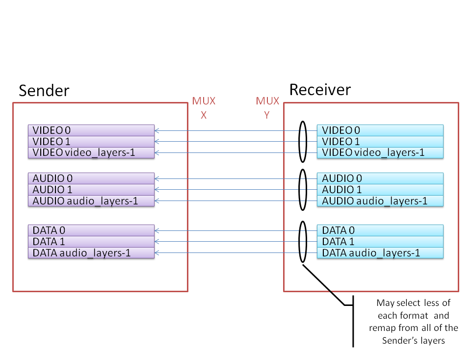

# Matrox: One Model to Rule them All
{:.no_toc}  
Copyright 2024, Matrox Graphics Inc.

Permission is hereby granted, free of charge, to any person obtaining a copy of this software and associated documentation files (the “Software”), to deal in the Software without restriction, including without limitation the rights to use, copy, modify, merge, publish, distribute, sublicense, and/or sell copies of the Software, and to permit persons to whom the Software is furnished to do so, subject to the following conditions:

The above copyright notice and this permission notice shall be included in all copies or substantial portions of the Software.

THE SOFTWARE IS PROVIDED “AS IS”, WITHOUT WARRANTY OF ANY KIND, EXPRESS OR IMPLIED, INCLUDING BUT NOT LIMITED TO THE WARRANTIES OF MERCHANTABILITY, FITNESS FOR A PARTICULAR PURPOSE AND NONINFRINGEMENT. IN NO EVENT SHALL THE AUTHORS OR COPYRIGHT HOLDERS BE LIABLE FOR ANY CLAIM, DAMAGES OR OTHER LIABILITY, WHETHER IN AN ACTION OF CONTRACT, TORT OR OTHERWISE, ARISING FROM, OUT OF OR IN CONNECTION WITH THE SOFTWARE OR THE USE OR OTHER DEALINGS IN THE SOFTWARE.
  
---
{:toc}

This document describes a model for configuring and controling with IS-11, using Sender and Receiver Capabilities, a fully described multiplexed stream in the same way an independent group of streams are processed. From a User point of view there should be no difference for configuring and controling the two streaming implementations. With the RTSP transport protocol there is effectively no difference from a User point of view resulting in the transport being either a multiplexed stream or a set of independent streams.

# Group of Independent Streams <---> Multiplexed sub-Streams

In our Model a group of Streams configured and transmitted independently is analogous to a multiplexed Stream transmitted as a single Stream where each sub-Stream is configured independently.

From a User point of view audio, video and data Streams/sub-Streams are nominated based on a format (audio, video, data) and an index/layer. For a User it is not necessary to know if `audio 0` refers to a Stream transmitted independently or a sub-Stream multiplexed and transmitted as part of a mux Stream. The implementation details differ. The former has multiple Senders that must each be controlled independently with IS-11 and IS-05. The later has a single Sender that is controlled with IS-05 at the mux level and IS-11 at the mux level and also at each sub-Stream level.

# Vendor specific configuration of the topology

In our model, a vendor specific mechanism allows a User/Administrator to select/configure the Streams that are part of a group (i.e. how many of each format), which determine the Senders allocated for the group. This vendor specific configuration establishes the topology and routing of essences from Sources to independent Senders.

Similary a vendor specific mechanism allows a User/Administrator to select/configure the sub-Streams that are part of a multiplexed stream (i.e. how many of each format), which determine the layers transmitted by the mux Sender. This vendor specific configuration establishes the topology and routing of essences from Sources to the mux Sender.

A Controller should manage a group of Senders as a set of audio, video and data Streams where for each format a User can select the number of active Streams, trimming the Streams of higher indexes. For example allowing only 1 audio stream from a group of 3 audio streams would retain only `AUDIO 0`. It should not be possible to individually select a Stream but a count starting at index 0. This simplification align the management of groups with the management of multiplexed streams.

Similarly, a Controller should manage a group of sub-Stream from a multiplexed Sender as a set of audio, video and data Streams where for each format a User can select the number of active sub-Streams, trimming the sub-Streams of higher layers. For example allowing only 1 audio sub-Stream from a multiplexed Stream of 3 audio sub-Streams would retain only `AUDIO 0`. It should not be possible to individually select a sub-Stream but a count starting at layer 0.

The flexibility is provided to fully configure each Stream/sub-Stream of a group/mux such that the previous simplification about the management of the individual Streams and sub-Streams represent a reasonable compromise. The objective is to have a simple and mostly static topology model on the Sender side.

# Receiver Mapping to Sender Streams/sub-Streams

The independent Receivers of a group by default attach to the Streams of a Sender having the same `<role-in-group> <role-index>` if any.

A Controller should manage a group of Receivers as a set of audio, video and data Streams where for each format a User can select the number of active Streams to be equal or lower than those of the Senders, trimming the Streams of higher indexes. For example allowing only 1 audio stream from a group of 3 audio streams would retain only `AUDIO 0`. It should not be possible to individually select a Stream but a count starting at index 0. This simplification align the management of groups with the management of multiplexed streams.

A Controller may manage as independent Streams, no longer part of a group, those Receivers that have been excluded from the group in the above selection by a User. This option allows the Receiver of a given group to consume Streams from independent Senders of distinct groups. It is an advanced option for managing independent Streams and should not be the default management option. This option is not available with a multiplexed Stream.

A Controller may allow a User to shuffle the attachment for each format the active Streams/sub-Streams. Such Controller has the responsibility to perform the same shuffle for the assocaited Receiver Capabilities. The Receivers are unaware that such shuffling is performed. Such management is totally under the control of a Controller. Such remapping is allowed also for a mux Receiver. The `audio_layers_mapping`, `video_layers_mapping` and `data_layers_mapping` transport attributes provides the necessary mechanism for a Controller to shuffle the attachment of the sub-Streams of a mux Receiver. This operation is analogue to what a Controller does with independent Streams, here at the sub-Stream level. Again the Receiver is responsible for shuffling the Receiver Capabilities the same way.

The shuffling operation allows independent Receivers or a multiplexed Receiver to access any of the Streams/sub-Streams produced by independent Senders or a multiplexed Sender but cannot duplicate those Streams/sub-Streams. Each index in a remapping array must be distinct.

# Examples

The following examples illustrate the various ways a topology of a single video essence and two audio essences can be transmitted using various transports and how each independent Flow or sub-Flow can be configured using IS-11.

For MPEG2-TS over RTP, SRT, UDP and RTSP (RTSP provides both MPEG2-TS and independent streams) the topology is about sub-Flows/sub-Streams multiplexed through a mux Flow/Stream associated to a single Sender. For independent Streams over RTP the topology is about independent Flows/Streams transmitted in parallel through independent Senders.

In all those use-cases the Senders and Receivers describe their capabilities for the `video 0`, `audio 0` and `audio 1` essences. A User configure the 3 essences: `video 0`, `audio 0` and `audio 1` and a Controller apply such configuration using IS-11 active constraints. The Controller abstracts the actual transport and streaming implementation, adapting to the actual transport and parallel/multiplexed use-case.

Those examples do not illustrate the origin of the essences flowing through the Sources. Those could come from Receivers, Inputs or sensors/generators/files.

All those examples are compatible with the Privacy Encryption Protocol (PEP) which operate at the transport level.

## MPEG2-TS over RTP

## MPEG2-TS over SRT

## MPEG2-TS over UDP

## MPEG2-TS or Independent Streams over RTSP

An interesting aspect of the RTSP transport is that the actual transport for the media Streams/sub-Streams is configurable through IS-11 using the proper `media_type` among `application/MP2T`, `application/mp2t` and `application/rtsp`.

## Independent Streams over RTP

For independent streams the concept of groups is used and each Stream is given a `<role-in-group> <role-index>` tag within their group. The video and audio Flows are not sub-Flow and as such do not have a `layer` attribute. From a User perspective the `<role-index>` provides the same functionality as the `layer` for sub-Streams. A User is given either `VIDEO 0`, `AUDIO 0` and `AUDIO 1` as idenfitiers from the `grouphint` or `video 0`, `audio 0` and `audio 1` from the `(format, layer)` pairs. In both cases the same information is provided to the User and the underlying transport implementation is abstracted.
